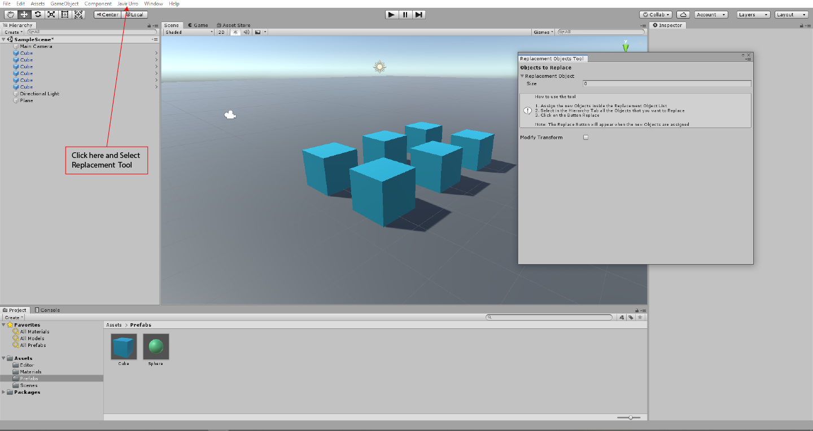
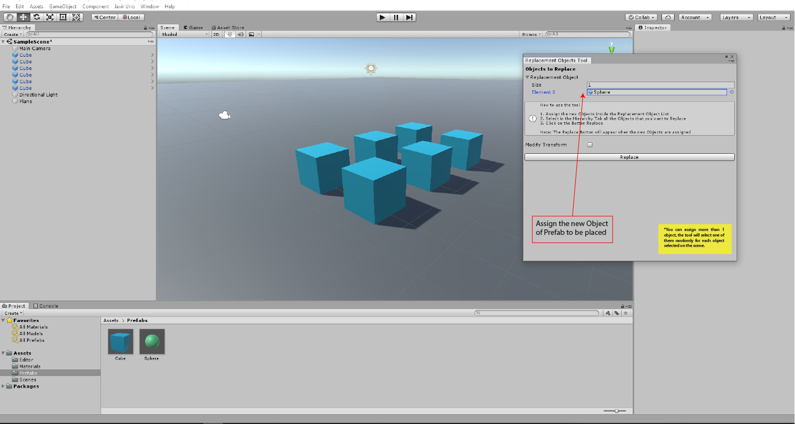
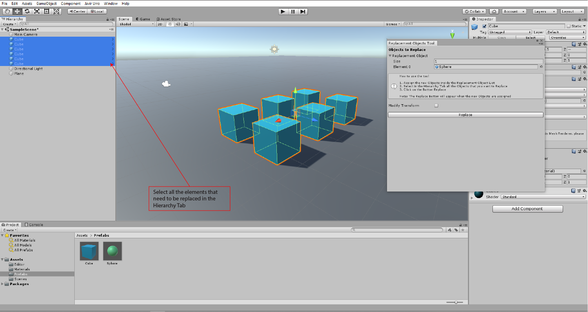
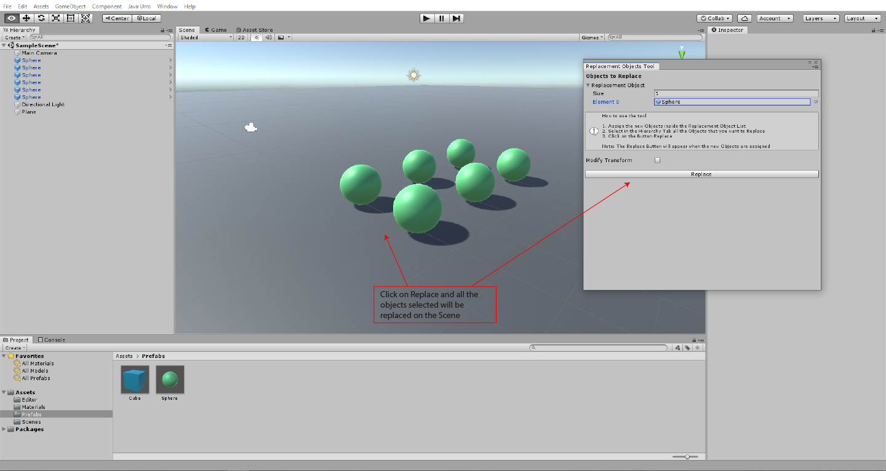

# Object_Replacement_Tool

This project helps to replace one or more objects inside a Unity Scene selecting posible "new target" objects 
from a List that the user can set easily in Unity's UI.

1. To Open the tool, go to the Menu Javir Urro and Select Replacement Tool, it will open a new window to use the tool.

2. Assign the new objects to place on the screen inside the List named Replacement Object, you can add as many objects as you want.

3. Once you have assigned the objects to be placed on the Scene, Select the objects that you want to replace/Change from the Hierarchy Tab, 
you can select as many objects as you want to Replace.

4. Last step when the objects to replace are selected and the list with the new objects have at least one posible option, Click on Replace button
and all the objects selected will be replaced immediately on the Scene.

